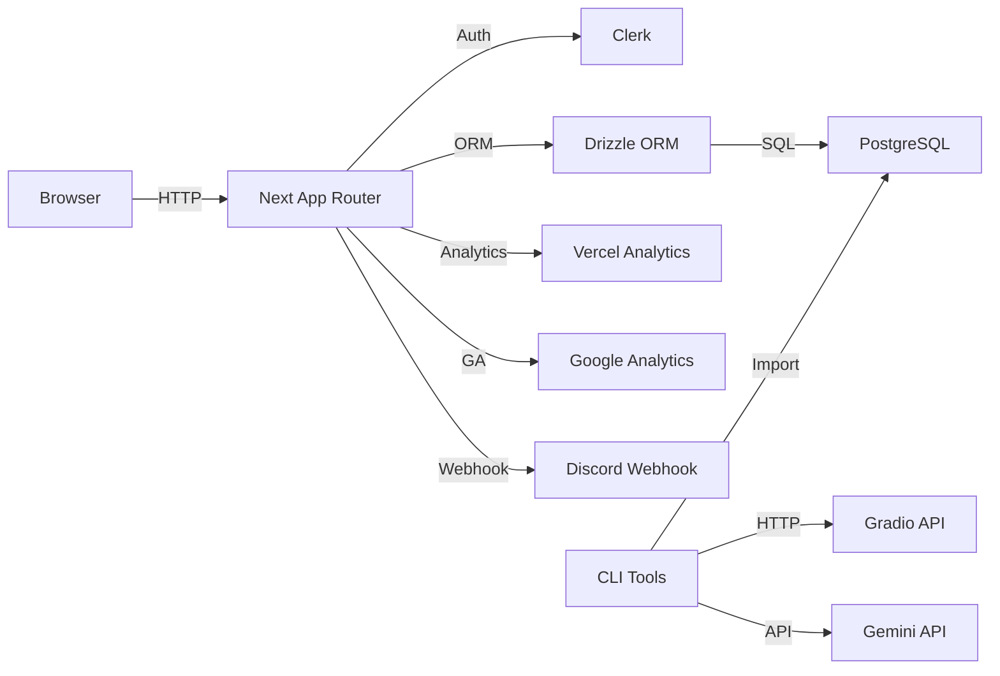
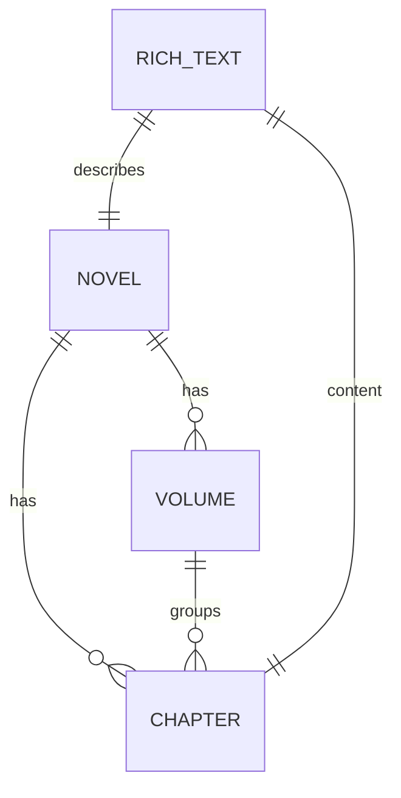

# Quaslation


Evidence-based technical overview and setup guide for the Quaslation web application.

- Version: 2.14.1 from [package.json](package.json)
- Maturity: Active development with semantic versioning and detailed changelog entries ([CHANGELOG.md](CHANGELOG.md))
- CI: GitHub Actions build workflow present ([.github/workflows/nextjs-build.yml](.github/workflows/nextjs-build.yml))

## Table of Contents
- [Project description](#project-description)
- [Key features and where they live](#key-features-and-where-they-live)
- [Architecture overview](#architecture-overview)
- [Architecture diagram](#architecture-diagram)
- [Data model](#data-model)
- [Entity relationships](#entity-relationships)
- [Setup and local development](#setup-and-local-development)
- [Production and deployment](#production-and-deployment)
- [CLI tools](#cli-tools)
- [Environment variables](#environment-variables)
- [Testing, linting, and type checking](#testing-linting-and-type-checking)
- [CI/CD](#cicd)
- [Observability and analytics](#observability-and-analytics)
- [Security](#security)
- [Performance and scalability](#performance-and-scalability)
- [Roadmap and known limitations](#roadmap-and-known-limitations)
- [Contributing](#contributing)
- [License and contact](#license-and-contact)
- [Differentiators at a glance](#differentiators-at-a-glance)

## Project description
Quaslation is a Next.js App Router application for publishing high-quality fan translations of Asian web novels. It provides a reader UX, RSS feed, SEO utilities, an admin surface for managing novels and chapters, and CLIs to fetch, translate, and import content into PostgreSQL via Drizzle ORM.

## Key features and where they live
- Reader experience and site pages
  - Home and marketing: [page.tsx](src/app/(main)/page.tsx)
  - Novels and listing: [page.tsx](src/app/(main)/novels/page.tsx)
  - Novel details: [page.tsx](src/app/(main)/novels/[slug]/page.tsx)
  - Chapter reading: [page.tsx](src/app/(main)/novels/[slug]/[chapter]/page.tsx)
  - MDX content pages: [about/page.mdx](src/app/(main)/(mdx)/about/page.mdx), [privacy/page.mdx](src/app/(main)/(mdx)/privacy/page.mdx), [terms-of-service/page.mdx](src/app/(main)/(mdx)/terms-of-service/page.mdx)
  - Navigation and layout: [RootLayout()](src/app/layout.tsx#L31), [Navbar()](src/app/_components/navbar.tsx#L23)
- Feeds and SEO
  - Static sitemap: [sitemap()](src/app/sitemap.ts#L3)
  - RSS feed with ISR and tag-based revalidation: [GET()](src/app/rss.xml/route.ts#L47)
- Authentication and session
  - Clerk integration: [ClerkProvider](src/app/layout.tsx) within [RootLayout()](src/app/layout.tsx#L31)
  - Sign in/up routes provided under [src/app/auth](src/app/auth)
- Admin application
  - Admin index: [page.tsx](src/app/admin/page.tsx)
  - Chapters admin: [page.tsx](src/app/admin/chapters/page.tsx)
  - Novel admin: [page.tsx](src/app/admin/novel/page.tsx)
  - Create/edit flows under [src/app/admin](src/app/admin)
- Comments and community
  - Disqus component: [DisqusComponent.tsx](src/components/shared/DisqusComponent.tsx)
  - Discord join/support UI: [join-discord.tsx](src/components/shared/join-discord.tsx)
- Analytics and ads
  - Vercel Analytics and Google Analytics: [RootLayout()](src/app/layout.tsx#L31)
  - Google AdSense injection: [google-adsense.tsx](src/components/system/google-adsense.tsx) and [layout.tsx](src/app/(main)/layout.tsx)
- Translation tooling
  - Gemini-based translation and uploader: [scripts/gemini/README.md](scripts/gemini/README.md), [main.ts](scripts/gemini/main.ts), [upload.ts](scripts/gemini/upload.ts)
  - Kakuyomu fetcher and Gradio-based translator: [scripts/translation/README.md](scripts/translation/README.md), [kakuyomu-fetch.ts](scripts/translation/kakuyomu-fetch.ts), [translate.ts](scripts/translation/translate.ts)
- Database access layer (Drizzle ORM)
  - Schema and relations: [schema.ts](src/lib/db/schema.ts), [relations.ts](src/lib/db/relations.ts)
  - Runtime db instance: [index.ts](src/lib/db/index.ts)
  - Composable queries: [query.ts](src/lib/db/query.ts) including [getReleases()](src/lib/db/query.ts#L6), [getNovelBySlug()](src/lib/db/query.ts#L56), [getChapterBySlug()](src/lib/db/query.ts#L90), [getUserRole()](src/lib/db/query.ts#L268)

## Architecture overview
- Platform and frameworks
  - Next.js 15 App Router with React 19 and TypeScript
  - Styling: Tailwind CSS with typography plugin and animations
  - UI primitives: Radix UI and components under [src/components/ui](src/components/ui)
- Persistence and ORM
  - PostgreSQL with Drizzle ORM; schema in [schema.ts](src/lib/db/schema.ts) and relations in [relations.ts](src/lib/db/relations.ts)
  - Runtime driver uses @vercel/postgres via [index.ts](src/lib/db/index.ts); migration tooling via drizzle-kit configured in [drizzle.config.ts](drizzle.config.ts)
- Authentication and authorization
  - Clerk for auth with server/client components initialized in [RootLayout()](src/app/layout.tsx#L31)
  - Role model via enum Role ADMIN/SUBSCRIBER/MEMBER in [schema.ts](src/lib/db/schema.ts)
  - Helper for role retrieval [getUserRole()](src/lib/db/query.ts#L268)
- Caching and content delivery
  - Next ISR and tag-based invalidation on RSS route via unstable_cache in [GET()](src/app/rss.xml/route.ts#L47)
  - Client router cache reuse tuned via experimental.staleTimes in [next.config.mjs](next.config.mjs)
- Messaging and integrations
  - Discord webhooks for contact/support: [actions.ts](src/app/(main)/contact/actions.ts)
  - Comments via Disqus component: [DisqusComponent.tsx](src/components/shared/DisqusComponent.tsx)
- Analytics and monetization
  - Vercel Analytics and Google Analytics in [RootLayout()](src/app/layout.tsx#L31)
  - Google AdSense in [layout.tsx](src/app/(main)/layout.tsx)

## Architecture diagram


## Data model
Primary entities defined in [schema.ts](src/lib/db/schema.ts):
- User: clerkId (PK), role (enum)
- RichText: text, html, markdown
- Novel: slug, title, thumbnail, timestamps, richTextId (unique)
- Volume: number, title, novelId, timestamps
- Chapter: premium, slug, novelId, volumeId, serial, number, title, timestamps, richTextId
Notable constraints:
- Unique Novel.slug/title; unique Novel.richTextId link
- Volume unique on novelId+number
- Chapter unique on novelId+serial and volumeId+number; index on premium

## Entity relationships


## Setup and local development
Prerequisites
- Node.js 20.x (CI uses Node 20 in [.github/workflows/nextjs-build.yml](.github/workflows/nextjs-build.yml))
- PostgreSQL instance (local or cloud); see migration docs under [scripts/migrate](scripts/migrate)

Install and configure
- Install dependencies
  - ```bash
    npm install
    ```
- Create environment file
  - ```bash
    cp .env.example .env.local
    ```
- Populate required env vars (see Environment variables), especially DIRECT_URL for drizzle-kit

Database schema and migrations
- Drizzle config points to [schema.ts](src/lib/db/schema.ts) and outputs to [src/lib/db](src/lib/db) in [drizzle.config.ts](drizzle.config.ts)
- Commands
  - Generate SQL: 
    ```bash
    npm run db:generate
    ```
  - Apply migrations: 
    ```bash
    npm run db:migrate
    ```
  - Push schema: 
    ```bash
    npm run db:push
    ```
  - Studio: 
    ```bash
    npm run db:studio
    ```

Run locally
- Development server: 
  ```bash
  npm run dev
  ```
- Lint: 
  ```bash
  npm run lint
  ```
- Type check: 
  ```bash
  npx tsc --noEmit
  ```

Build and start
- Production build: 
  ```bash
  npm run build
  ```
- Start server: 
  ```bash
  npm run start
  ```

## Production and deployment
- Runtime DB driver is @vercel/postgres via [index.ts](src/lib/db/index.ts), indicating Vercel-friendly deployment. @vercel/analytics is enabled.
- Alternative Postgres providers can be used if environment variables are provided. Migration docs cover Supabase → Neon: [scripts/migrate/README.md](scripts/migrate/README.md)
- Images remotePatterns whitelist Supabase storage in [next.config.mjs](next.config.mjs)

## CLI tools
Gemini translation toolkit
- Guide: [scripts/gemini/README.md](scripts/gemini/README.md)
- Translate with concurrency and resume:
  - ```bash
    npx tsx scripts/gemini/main.ts --volume all --concurrency 2
    ```
- Upload translated markdown to DB:
  - ```bash
    npx tsx scripts/gemini/upload.ts --novel-id 17 --verbose
    ```

Kakuyomu fetcher and Gradio translator
- Guide: [scripts/translation/README.md](scripts/translation/README.md)
- Fetch chapters:
  - ```bash
    npx tsx scripts/translation/kakuyomu-fetch.ts --url https://kakuyomu.jp/works/16818093090655323692 --out scripts/output/translation
    ```
- Translate with resume/skip:
  - ```bash
    npx tsx scripts/translation/translate.ts --baseDir scripts/output/translation --work 16818093090655323692 --concurrency 2
    ```

## Environment variables
Defined in [.env.example](.env.example) and referenced in code
- Authentication
  - CLERK_SECRET_KEY
  - NEXT_PUBLIC_CLERK_PUBLISHABLE_KEY
  - NEXT_PUBLIC_CLERK_SIGN_IN_URL (default /auth/sign-in)
  - NEXT_PUBLIC_CLERK_SIGN_UP_URL (default /auth/sign-up)
- Analytics and ads
  - NEXT_PUBLIC_GOOGLE_ANALYTICS_ID used in [RootLayout()](src/app/layout.tsx#L31)
  - NEXT_PUBLIC_GOOGLE_ADSENSE_ID used in [layout.tsx](src/app/(main)/layout.tsx)
- Community and support
  - DISCORD_WEBHOOK_URL used in [utils.ts](src/lib/utils.ts)
  - DISCORD_WEBHOOK_SUPPORT_URL used in [actions.ts](src/app/(main)/contact/actions.ts)
- Database and tooling
  - DIRECT_URL used by drizzle-kit in [drizzle.config.ts](drizzle.config.ts)
- AI integrations
  - GEMINI_API_KEY used in [main.ts](scripts/gemini/main.ts#L13)
  - GRADIO_API_URL used in [translate.ts](scripts/translation/translate.ts#L117) and admin [translate-actions.ts](src/app/admin/chapters/[novelId]/create/translate-actions.ts)

## Testing, linting, and type checking
- Tests: No test suites detected in [package.json](package.json). TODO: add unit/integration tests and coverage.
- Linting: ESLint via Next config; run 
  ```bash
  npm run lint
  ```
- Type checking: run 
  ```bash
  npx tsc --noEmit
  ```

## CI/CD
- Build verification in GitHub Actions: [.github/workflows/nextjs-build.yml](.github/workflows/nextjs-build.yml) uses Node 20, restores Next cache, and runs build.
- No coverage or deploy workflows present in repo; badges intentionally omitted.

## Observability and analytics
- Vercel Analytics initialized in [RootLayout()](src/app/layout.tsx#L31)
- Optional Google Analytics via NEXT_PUBLIC_GOOGLE_ANALYTICS_ID

## Security
- Authentication via Clerk; app shell wraps with [ClerkProvider](src/app/layout.tsx)
- Role model for users via enum Role in [schema.ts](src/lib/db/schema.ts)
- Premium content gating via Chapter.premium and indexed access patterns in [schema.ts](src/lib/db/schema.ts) and queries like [getReleases()](src/lib/db/query.ts#L6)
- Webhooks to Discord for support requests [actions.ts](src/app/(main)/contact/actions.ts)
- Secrets via environment variables; ensure .env.local is not committed

## Performance and scalability
- Query design leverages indices and joins in [query.ts](src/lib/db/query.ts)
- Cached feed generation via ISR and unstable_cache [GET()](src/app/rss.xml/route.ts#L47)
- Client router cache reuse via staleTimes in [next.config.mjs](next.config.mjs)
- Pagination and limits applied in [getReleases()](src/lib/db/query.ts#L6), [getChapters()](src/lib/db/query.ts#L188)

## Roadmap and known limitations
- Add automated tests and coverage reporting. TODO
- Add deploy workflow (Vercel or other) and optional status badges. TODO
- Clarify runtime DB configuration for local dev when not using @vercel/postgres. TODO
- Containerization and dev database bootstrap scripts. TODO
- Observability beyond analytics: structured logging and tracing. TODO

## Contributing
- This repository is currently source-available; external contributions are not accepted.
- Code quality: run lint and type-check before changes.
- For translation tool contributions, see [scripts/gemini/README.md](scripts/gemini/README.md) and [scripts/translation/README.md](scripts/translation/README.md)

## License and contact
- Treat as source-available; do not redistribute without permission.
- Maintainer contact: shreyashr267@gmail.com

## Differentiators at a glance
- End-to-end pipeline for novel translation: fetch, translate (Gemini or Gradio), and upload to DB, documented under [scripts](scripts)
- Clean, type-safe data access with Drizzle and explicit schema [schema.ts](src/lib/db/schema.ts)
- Production-aware caching and SEO with RSS + sitemap [GET()](src/app/rss.xml/route.ts#L47), [sitemap()](src/app/sitemap.ts#L3)
