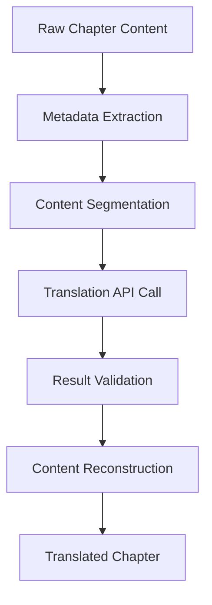

# Translation Architecture Design

## Architecture Overview


## Technical Specifications

### 1. Metadata Extraction
- **Input**: HTML/Markdown content
- **Components**:
  - Unified.js (remark/rehype) for parsing
  - Custom extractors for:
    - Chapter title (first H1)
    - Character names (proper noun detection)
    - Key terms (TF-IDF analysis)
    - Cultural references (pattern matching)
- **Output**: JSON metadata + segmented content

### 2. OpenRouter API Integration
- **Endpoint**: `https://openrouter.ai/api/v1/chat/completions`
- **Authentication**: Bearer token
- **Request Format**:
  ```json
  {
    "model": "openai/gpt-4",
    "messages": [
      {"role": "system", "content": "Translate to {lang}"},
      {"role": "user", "content": "Text to translate"}
    ]
  }
  ```
- **Rate Limiting**: 5,000 tokens/minute

### 3. Error Handling Framework
- **Error Types**:
  - API Errors (429, 401, 500)
  - Content Parsing Errors
  - Translation Quality Issues
- **Recovery Strategies**:
  - Exponential backoff retries
  - Fallback to cached translations
  - Manual review queue
- **Monitoring**:
  - Sentry integration
  - Discord webhook alerts

### 4. Content Processing Pipeline
1. Input sanitization
2. Structure preservation (HTML tags/code blocks)
3. Segmentation (max 2000 tokens/segment)
4. API request with metadata context
5. Response validation
6. Content reconstruction
7. Quality assessment

## Security Considerations
- **API Key Management**:
  - Storage in `.env` (already in .rooignore)
  - Vercel environment variables
  - Monthly rotation schedule
- **Access Control**:
  - Server-side only execution
  - Admin role requirement
- **Data Handling**:
  - No PII in translation requests
  - Ephemeral processing storage

## Environment Variables
```env
# Required
OPENROUTER_API_KEY=your_api_key_here

# Optional
TRANSLATION_CACHE_TTL=3600
MAX_RETRIES=3
FALLBACK_LANG=en
```

## Documentation Structure
1. `ARCHITECTURE.md` - This document
2. `SETUP.md` - Installation and configuration
3. `USAGE.md` - How to trigger translations
4. `ERROR_HANDLING.md` - Troubleshooting guide
5. `SECURITY.md` - Key management procedures