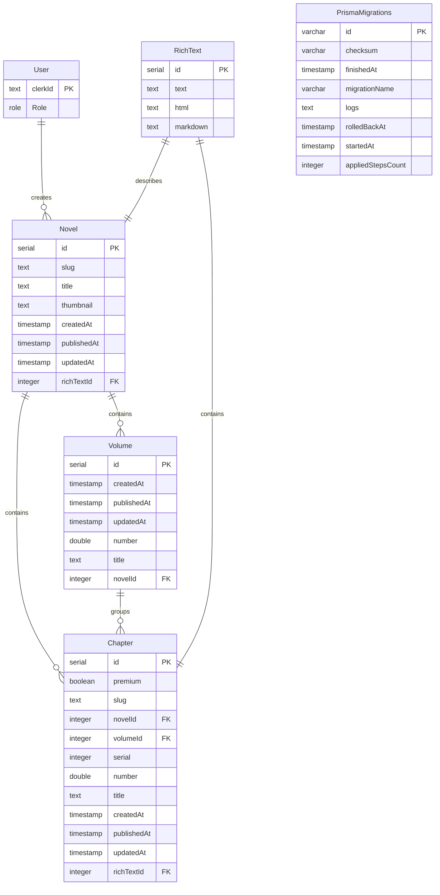

# Database Schema Documentation

This document provides a comprehensive overview of the current database schema used in the Quaslation project.

## Tables Overview

### 1. User Table
Stores user information from Clerk authentication.

**Columns:**
- `clerkId` (text, Primary Key): The user's ID from Clerk
- `role` (Role enum): The user's role (ADMIN, SUBSCRIBER, MEMBER), defaults to MEMBER

### 2. RichText Table
Stores rich text content in multiple formats.

**Columns:**
- `id` (serial, Primary Key): Unique identifier for the rich text content
- `text` (text): Plain text content
- `html` (text): HTML representation of the content
- `markdown` (text): Markdown representation of the content

### 3. Novel Table
Stores information about novels.

**Columns:**
- `id` (serial, Primary Key): Unique identifier for the novel
- `slug` (text, Unique): URL-friendly slug for the novel
- `title` (text, Unique): Title of the novel
- `thumbnail` (text, Nullable): URL of the novel's thumbnail image
- `createdAt` (timestamp, Default: CURRENT_TIMESTAMP): Date and time the novel was created
- `publishedAt` (timestamp, Nullable): Date and time the novel was published
- `updatedAt` (timestamp, Default: CURRENT_TIMESTAMP): Date and time the novel was last updated
- `richTextId` (integer, Unique, Foreign Key): References RichText.id

### 4. Volume Table
Stores information about volumes of novels.

**Columns:**
- `id` (serial, Primary Key): Unique identifier for the volume
- `createdAt` (timestamp, Default: CURRENT_TIMESTAMP): Date and time the volume was created
- `publishedAt` (timestamp, Nullable): Date and time the volume was published
- `updatedAt` (timestamp, Default: CURRENT_TIMESTAMP): Date and time the volume was last updated
- `number` (double precision): Volume number
- `title` (text, Nullable): Title of the volume
- `novelId` (integer, Foreign Key): References Novel.id

### 5. Chapter Table
Stores information about chapters of novels.

**Columns:**
- `id` (serial, Primary Key): Unique identifier for the chapter
- `premium` (boolean, Default: true): Whether the chapter is a premium chapter
- `slug` (text, Unique): URL-friendly slug for the chapter
- `novelId` (integer, Foreign Key): References Novel.id
- `volumeId` (integer, Foreign Key): References Volume.id
- `serial` (integer): Serial number of the chapter within the novel
- `number` (double precision): Chapter number within the volume
- `title` (text): Title of the chapter
- `createdAt` (timestamp, Default: CURRENT_TIMESTAMP): Date and time the chapter was created
- `publishedAt` (timestamp, Nullable): Date and time the chapter was published
- `updatedAt` (timestamp, Default: CURRENT_TIMESTAMP): Date and time the chapter was last updated
- `richTextId` (integer, Unique, Foreign Key): References RichText.id

### 6. PrismaMigrations Table
Used by Prisma to track database migrations.

**Columns:**
- `id` (varchar(36), Primary Key): Migration ID
- `checksum` (varchar(64)): Migration checksum
- `finishedAt` (timestamp with time zone, Nullable): When the migration finished
- `migrationName` (varchar(255)): Name of the migration
- `logs` (text, Nullable): Migration logs
- `rolledBackAt` (timestamp with time zone, Nullable): When the migration was rolled back
- `startedAt` (timestamp with time zone, Default: now()): When the migration started
- `appliedStepsCount` (integer, Default: 0): Number of applied steps

## Relationships

### Foreign Key Constraints
1. Volume.novelId → Novel.id (ON DELETE restrict, ON UPDATE cascade)
2. Novel.richTextId → RichText.id (ON DELETE restrict, ON UPDATE cascade)
3. Chapter.novelId → Novel.id (ON DELETE restrict, ON UPDATE cascade)
4. Chapter.richTextId → RichText.id (ON DELETE restrict, ON UPDATE cascade)
5. Chapter.volumeId → Volume.id (ON DELETE restrict, ON UPDATE cascade)

### Unique Indexes
1. Volume_novelId_number_key: (novelId, number)
2. Novel_richTextId_key: richTextId
3. Novel_slug_key: slug
4. Novel_title_key: title
5. Chapter_novelId_serial_key: (novelId, serial)
6. Chapter_richTextId_key: richTextId
7. Chapter_slug_key: slug
8. Chapter_volumeId_number_key: (volumeId, number)

### Regular Indexes
1. Chapter_premium_idx: premium

## Data Flow Dependencies

The data has the following dependency hierarchy:
1. RichText (independent)
2. User (independent)
3. PrismaMigrations (independent)
4. Novel (depends on RichText)
5. Volume (depends on Novel)
6. Chapter (depends on Novel, Volume, RichText)

This hierarchy is important for both export and import operations to maintain referential integrity.

## Database Schema Diagram

